# Pinterest Project

Pinterest project.

## Milestone 1 - Environment setup

The first milestone involved setting up the Github repository as well as the dev environment. For this project, pymysql was installed through pip and several modules were imported including requests, boto3 and sqlalchemy. The AWS account that was to be used for this project was also set up at this stage using pre-existing credentials provided - various aspects of the project were provided along with an IAM user and SSH Keypair ID in order to locate all the correct resources and to be able to access them.

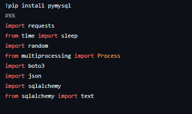

## Milestone 2 - Starting to build the pipeline

The second milestone was to import a python file into VSCode containing a script that communicated with an RDS database containing data to receive it in three tables: pinterest_data, geolocation_data and user_data. The data output here when running this was to emulate what a Pinterest API would receive when a POST request is made by users uploading data to Pinterest.

- A class was created here with a method `create_db_connector()` with various parameters such as `HOST`, `USER`, `PASSWORD`, `DATABASE`, and `PORT` all of which allowed a connection to the database containing all the data we need for this project.

- The function `run_infinite_post_data_loop` was used to create an infinite post data loop using a `while True:` loop to continuously receive and output data. Various SQL commands are also used to specifically receive a single random row of data from each table of data.

- The three tables contained data about posts being updated to Pinterest (`pinterest_data`), data about the geolocation of each Pinterest post (`geolocation_data`) and data about the user that uploaded each post (`user_data`). `For` loops were used to iterate through each set of data in order to output them as a dictionary of key value pairs with the headings as the key and the data itself as the value using `dict(row._mapping)`.

## Milestone 3 - Batch processing: EC2 Kafka client configuration

The third milestone was to connect to an MSK cluster and set up Kafka on a client EC2 instance.

- A key pair file was created locally in a linux directory `/home/nazwaz` as a `.pem` file in order to connect to the EC2 instance. The content of this key pair file was found by navigating to the parameter store and finding the specific key pair. By finding this, the value was copied including the `BEGIN` and `END` headers into the file and saved as `12b287eedf6d.pem`

- To ensure the key was not publicly viewable, the following command was used: `chmod 400 12b287eedf6d-key-pair.pem`. Then another command was used in the WSL terminal to connect to the EC2 isntance using it's public DNS: 
`ssh -i "12b287eedf6d-key-pair.pem" root@ec2-54-81-124-13.compute-1.amazonaws.com`.

- Within the EC2 client, Java was installed using `sudo yum install java-1.8.0` and Apache Kafka was downloaded first using 
`wget https://archive.apache.org/dist/kafka/2.8.1/kafka_2.12-2.8.1.tgz`. This zip file was then extracted using 
`tar -xzf kafka_2.12-2.8.1.tgz`. 

- Using `ls` in the home directory showed the kafka directory and within the `libs` directory here the command 
`wget https://github.com/aws/aws-msk-iam-auth/releases/download/v1.1.5/aws-msk-iam-auth-1.1.1-all.jar` was run to download the IAM MSK authentication package from github. This was neccessary as the MSK cluster used for this project uses IAM to check whether the client is authenticated and authorised to produce to the cluster.

- An environment variable called `CLASSPATH` was created to store the authentication jar file so that commands executed anywhere in the kafka client can be used. This was done using `export CLASSPATH=/home/ec2-user/kafka_2.12-2.8.1/libs/aws-msk-iam-auth-1.1.1-all.jar` within the bashrc file which could be edited using `nano ~/.bashrc`. It was added here so that the CLASSPATH was set up for every instance or new session. This was checked using `echo $CLASSPATH` to see if the path that is output is the same as the path assigned to CLASSPATH. 

- The IAM console on AWS was needed here to properly authenticate to the MSK cluster. The role tied to my user id was found and the role ARN here `arn:aws:iam::584739742957:role/12b287eedf6d-ec2-access-role` was needed. Within trust relationships, the trust policy was edited by adding a principal with 'IAM roles' was the principal type and replacing the ARN value with what was just copied.

- To finish the Kafka client configuration to use AWS IAM, a file was created in the `bin` folder using `nano client.properties`. Again, the ARN copied from earlier is also copied into this `client.properties` file.

- Before any Kafka topics could be created, 2 things were needed from the MSK cluster: the Bootstrap servers string `b-1.pinterestmskcluster.w8g8jt.c12.kafka.us-east-1.amazonaws.com:9098,b-2.pinterestmskcluster.w8g8jt.c12.kafka.us-east-1.amazonaws.com:9098,b-3.pinterestmskcluster.w8g8jt.c12.kafka.us-east-1.amazonaws.com:9098` and the Plaintext Apache Zookeeper connection string `z-2.pinterestmskcluster.w8g8jt.c12.kafka.us-east-1.amazonaws.com:2181,z-1.pinterestmskcluster.w8g8jt.c12.kafka.us-east-1.amazonaws.com:2181,z-3.pinterestmskcluster.w8g8jt.c12.kafka.us-east-1.amazonaws.com:2181`. These were both found under client informatin through the MSK management console.

- Within the Kafka bin folder, the three topics `12b287eedf6d.pin`, `12b287eedf6d.geo` and `12b287eedf6d.user` were created using the following commands: 

`./kafka-topics.sh --bootstrap-server b-1.pinterestmskcluster.w8g8jt.c12.kafka.us-east-1.amazonaws.com:9098,b-2.pinterestmskcluster.w8g8jt.c12.kafka.us-east-1.amazonaws.com:9098,b-3.pinterestmskcluster.w8g8jt.c12.kafka.us-east-1.amazonaws.com:9098 --command-config client.properties --create --topic 12b287eedf6d.pin`

`./kafka-topics.sh --bootstrap-server b-1.pinterestmskcluster.w8g8jt.c12.kafka.us-east-1.amazonaws.com:9098,b-2.pinterestmskcluster.w8g8jt.c12.kafka.us-east-1.amazonaws.com:9098,b-3.pinterestmskcluster.w8g8jt.c12.kafka.us-east-1.amazonaws.com:9098 --command-config client.properties --create --topic 12b287eedf6d.geo`

`./kafka-topics.sh --bootstrap-server b-1.pinterestmskcluster.w8g8jt.c12.kafka.us-east-1.amazonaws.com:9098,b-2.pinterestmskcluster.w8g8jt.c12.kafka.us-east-1.amazonaws.com:9098,b-3.pinterestmskcluster.w8g8jt.c12.kafka.us-east-1.amazonaws.com:9098 --command-config client.properties --create --topic 12b287eedf6d.user`

- `./kafka-topics.sh` was used to create the topic with several parameters passed through including the bootstrap server string, the client.properties file for permissions and the name of the topic.

## Milestone 4 - Batch processing: Connecting MSK cluster to S3 bucket

The fourth milestone was to connect the MSK cluster to an S3 bucket using MSK connect so that any data sent to the cluster would be automatically saved and stored within this S3 bucket. The bucket for this project had already been created with the name `user-12b287eedf6d-bucket` along with a VPC endpoint to S3 and an IAM role needed to write to this bucket.

- In order to create a custom plugin, containing code defining the logic of the connector created later on, the EC2 client was used again to connect to the cluster. First `sudo -u ec2-user -i` was used to assume admin priveleges and a directory for the connector was created using `mkdir kafka-connect-s3 && cd kafka-connect-s3`. Then the Confluent.io Amazon S3 connector was downloaded using `wget https://d1i4a15mxbxib1.cloudfront.net/api/plugins/confluentinc/kafka-connect-s3/versions/10.0.3/confluentinc-kafka-connect-s3-10.0.3.zip` and then copied to the S3 bucket with `aws s3 cp ./confluentinc-kafka-connect-s3-10.0.3.zip s3://user-12b287eedf6d-bucket/kafka-connect-s3/`.

- The `kafka-connect-s3` folder was now created here inside the S3 bucket with the zip file.

- Next, the custom plugin `12b287eedf6d-plugin` was created under the MSK connect section of the MSK console using the S3 object url and the zip file that was saved here. Now the connector could be created using this custom plugin.

- The connector was created using the MSK connect section of the MSK console again, selecting the pinterest MSK cluster along with specific configuration settings. In these settings the `topics.regex` field was given the value `12b287eedf6d.*` to ensure all the data going through the three topics was saved to the S3 bucket. 

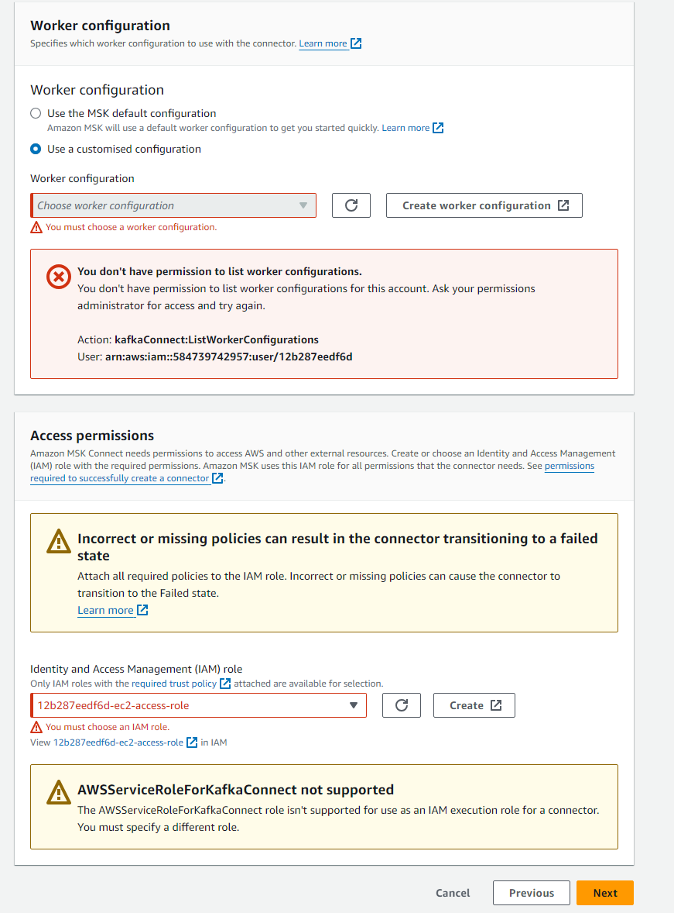

- For the worker configuration, customised configuration was selected so the confluent-worker configuration set up earlier could be used and for the access permissions, the IAM role containing the user id `12b287eedf6d` was selected also. Once the connector had been created with the name `12b287eedf6d-connector`, it showed up as running in the connectors tab. Now any data sent from the MSK cluster to the S3 bucket is uploaded into a folder called `topics`.

## Milestone 5 - Batch processing: Configuring API in API gateway

The fifth milestone was to build an API to send data to the MSK cluster and store it in the S3 bucket. The API itself was already created and provided so the resources and methods needed to be added.

- Using the API gateway, the API with the name `12b287eedf6d` was located and a `{proxy+}` resource was created. This proxy resource with the `ANY` method allows the integration access to all available resources because of the greedy parameter `{proxy+}`

- A HTTP `ANY` method was created with the endpoint url `http://ec2-54-81-124-13.compute-1.amazonaws.com:8082/{proxy}` which used the public DNS from the EC2 instance previously created.

- Once the proxy resource and `ANY` method was added to the API, it was then deployed with a stage name `test`. The invoke url `https://5i08sjvi96.execute-api.us-east-1.amazonaws.com/test` was important when communicating with the API later on.

- In order to consume the data using MSK from the API, a REST proxy packaged needed to be installed on the EC2 client, to communicate with the MSK cluster. `sudo wget https://packages.confluent.io/archive/7.2/confluent-7.2.0.tar.gz` was used to download the package and `tar -xvzf confluent-7.2.0.tar.gz` extracted the zip file, creating the `confluent-7.2.0` directory.

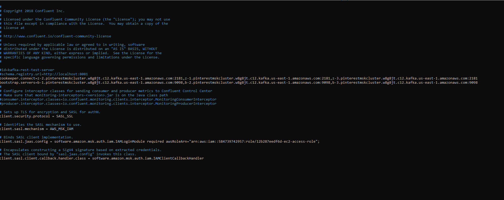

- The `kafka-rest.properties` file within the directory `confluent-7.2.0/etc/kafka-rest` needed to be modified to perform IAM authentication. The correct Booststrap server and Plaintext Apache Zookeeper connection strings were added in here along with the IAM MSK authentication package to allow communication between the REST proxy and the cluster brokers.

- The REST proxy had to be started before sending any messages to the API to make sure they are consumed in MSK. This was done in the `confluent-7.2.0/bin` directory using the command `./kafka-rest-start /home/ec2-user/confluent-7.2.0/etc/kafka-rest/kafka-rest.properties`. Once the proxy is ready to receive requests, the message `INFO Server started, listening for requests` could be seen.

- The `user_posting_emulation.py` file was modified to send data to the Kafka topics using the previously acquired API invoke url. Here, the invoke url was customised to set the destination to `12b287eedf6d.pin` within the topics folder in the S3 bucket. `json.dumps` was used to serialise the data from the `pin` table into a json file with the structure defined and the key value pairs being the header names and the records under each heading. 

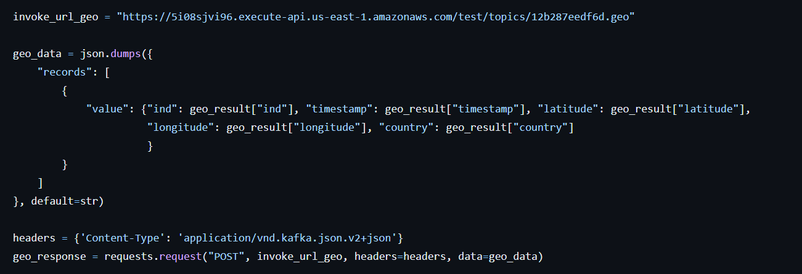

- The data from the `geo` table was instead stored in `12b287eedf6d.geo`, also within the topics folder. As the records within this table were different, each individual key value pair had to be identified to ensure the data was serialised correctly. `default=str` was also passed through here to ensure the timestamps were converted to strings before being converted into a json file.

- The data from the `user` table was stored in `12b287eedf6d.user` similarly to before.

- By printing the status code, the success of the requests could be monitored. A code of 200 indicated that the POST requests were successful.

- The REST proxy showed each request being sent to the API aswell as the destination for the data.

- Kafka consumers could also be created within the EC2 client to monitor the data being sent. Using `./kafka-console-consumer.sh --bootstrap-server b-1.pinterestmskcluster.w8g8jt.c12.kafka.us-east-1.amazonaws.com:9098,b-2.pinterestmskcluster.w8g8jt.c12.kafka.us-east-1.amazonaws.com:9098,b-3.pinterestmskcluster.w8g8jt.c12.kafka.us-east-1.amazonaws.com:9098 --group students --consumer.config client.properties --topic 12b287eedf6d.pin --from-beginning ` a consumer for the `pin` data was made. The Bootstrap server was used here again, aswell as the flags `--group students`, `--from beginning` and `--confumer.config client.properties` to ensure all the data could be seen in the consumer and that the correct permissions were being used.

- A consumer for the `geo` data was made using `./kafka-console-consumer.sh --bootstrap-server b-1.pinterestmskcluster.w8g8jt.c12.kafka.us-east-1.amazonaws.com:9098,b-2.pinterestmskcluster.w8g8jt.c12.kafka.us-east-1.amazonaws.com:9098,b-3.pinterestmskcluster.w8g8jt.c12.kafka.us-east-1.amazonaws.com:9098 --group students --consumer.config client.properties --topic 12b287eedf6d.geo --from-beginning`.

- A consumer for the `user` data was made using `./kafka-console-consumer.sh --bootstrap-server b-1.pinterestmskcluster.w8g8jt.c12.kafka.us-east-1.amazonaws.com:9098,b-2.pinterestmskcluster.w8g8jt.c12.kafka.us-east-1.amazonaws.com:9098,b-3.pinterestmskcluster.w8g8jt.c12.kafka.us-east-1.amazonaws.com:9098 --group students --consumer.config client.properties --topic 12b287eedf6d.user --from-beginning`

- The data could also be checked and monitored within the S3 bucket. A topics folder was now present containing folders for all three topics.

- Within each topic folder was a partition containing all the data records as json files.

## Milestone 6 - Batch processing: Databricks

The sixth milestone was to set up Databricks and mount the S3 bucket to Databricks. The AWS access and secret access keys did not need to be created at this stage as the account being used had already been granted all the neccessary permissions and full access, with the credentials uploaded into a csv file.

- The libraries for pyspark operations were imported and the csv file `authentication_credentials.csv` containing the AWS keys was read to Databricks into a spark dataframe using `spark.read()`.

- The access and secret access keys were extracted from the spark dataframe and every character of the secret access key was encoded even using `urllib.parse.quote()` for added security. 

- Finally the S3 bucket was mounted using the S3 URL and the mount name `MOUNT` using `dbutils.fs.mount()`.

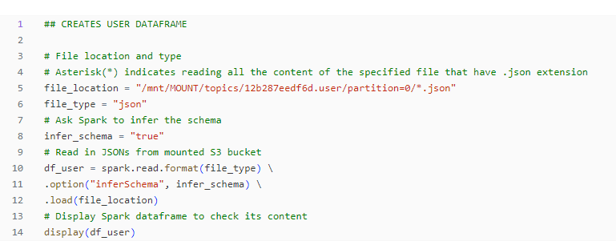

- The three dataframes `df_pin`, `df_geo` and `df_user` could then be created using the jsons from the S3 bucket. The file path to these json objects is given as the path added on to the mount path and again using `spark.read()`, each dataframe is created. There is no custom schema i.e. Spark infers the structure of the dataframe when mapping the json files into the dataframes.

## Milestone 7 - Batch processing: Spark on Databricks

The seventh milestone was to perform several data cleaning operations and computations on each of the Databricks dataframes using Spark.

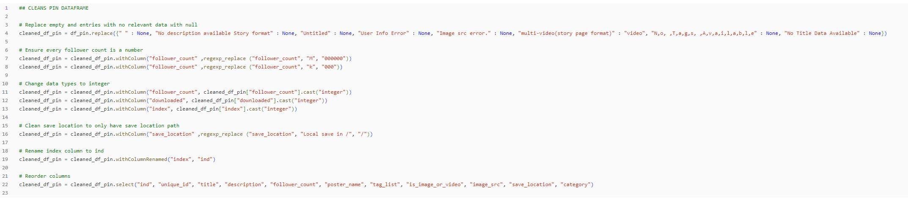

- First the `df_pin` dataframe containing the information about Pinterest posts was cleaned. As there were many entries with either no or irrelevant data, they were all replaced with null values using `.replace()` with a dictionary of key value pairs. Each key referred to what was going to be replaced within all columns of the dataframe and the value was `None` which would return `null`.

- The `follower_count` column contained letters such as k and M to represent thousand and million so `.withcolumn()` was used to replace this column along with `regexp_replace()` to find these characters and replace them with zeroes.

- The `follower_count` column was still a `string` data type so using `.withColumn()` together with `.cast()` the data type was changed to `integer`.

- The path in the `save_location` column was cleaned using `regexp_replace()` again to only include the save location path.

- The `index` column was renamed to `ind` using `.withColumNRenamed()`.

- Finally, all of the columns were reordered using `.select()` with the column names listed in order.

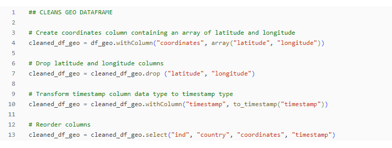

- Next the `df_geo` dataframe containing the information about geolocation was cleaned. 

- A new column `coordinates` was created using `.withColumn()` along with `array()` to combine the `latitude` and `longitude` columns into an array.

- These `latitude` and `longitude` columns were then dropped using `.drop()`.

- The `timestamp` column was also still a `string` data tpye so it was changed to a `timestamp` type using `.withColumn()` together with `to_timestamp()`.

- Finally, the columns were reordered.

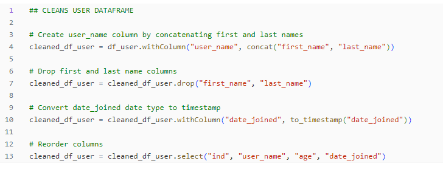

- Lastly the `df_user` dataframe containing the information about users was cleaned.

- A new column `user_name` was created using `.withColumn` and `concat()` to concatenate the records from both `first_name` and `last_name` columns into one.

- These `first_name` and `last_name` columsn were then dropped.

- The `date_joined` column also needed the data type changed from `string` to `timestamp`.

- Finally, the columns were reordered.

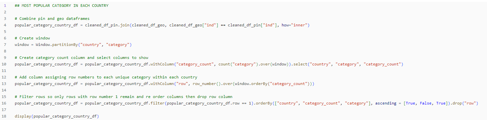

- This query was to find the most popular category in each country.

- The `pin` and `geo` dataframes were combined using an `inner` join based on the common column `ind`.

- A window was created on this new dataframe using the `Window` class to specify columns to partition and order by. Here, the window was partitioned by the `country` column first using `.partitionBy` and then by the `category` column.

- The `count().over()` function was applied on this window using `.withColumn` to create a new column called `category_count` which contained the number of elements in each group i.e. the total number of categories for each country. The columns were then filtered again using `.select()`

- Another column `row` was added to assign a row number to each unique category within each country (window) using `.withColumn` and `row_number().over()` but this time the window was ordered by the `category_count` column. 

- The duplicate `category_count` rows could be eliminated now by only keeping the records which had a `row` number equal to 1 using `.filter`. The data was reordered using `.orderBy` and finally the `row` column was removed.

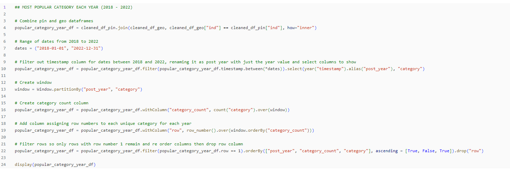

- This query was to find the most popular category each year.

- The `pin` and `geo` dataframes were combined using an `inner` join based on the common column `ind`.

- The `dates` variable was created and assigned dates between the started of 2018 and the end of 2022 as this was the range of dates to filter data between. Using `.between` and `.select(year())`, the dates were selected from the `timestamp column` and only the value of the year was taken. This column was named `post_year` using `.alias()`.

- A window was created and partitioned by `post_year` and `category`. 

- The `category_count()` column was created again using the window and `row_number()` functions.

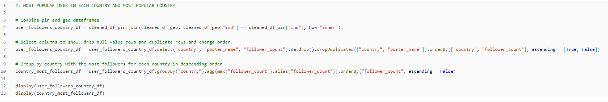

- This query was to find the most popular user in each country and furthermore the most popular country.

- The `pin` and `user` dataframes were combined using an `inner` join based on the common column `ind`.

- The `country`, `poster_name` and `follower_count` columns were selected and any null or duplicate values were dropped using `.na.drop().dropDuplicates` in the `country` and `poster_name` columns. 

- The dataframe was reordered using `.groupBy` to order the rows using the `country` column before finding the rows with the highest `follower_count` for each country using `.agg(max())`. Then it was reordered by `follower_count` starting with the most popular countries.

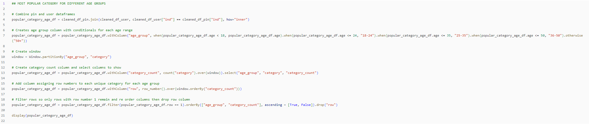

- This query was to find the most popular category for different age groups. 

- The `pin` and `geo` dataframes were combined using an `inner` join based on the common column `ind`.

- The `age_group` column was created using `.withColumn()` and `.when()` and `.otherwise` conditional clauses to define what the name of the of row should be if the value is within a certain range i.e. if the `age` value was less than or equal to 24, it would be replaced with "18-24".

- A window was created and partitioned by `age_group` and `category`.

- The `category_count` column was created again using the window and `row_number()` functions. 

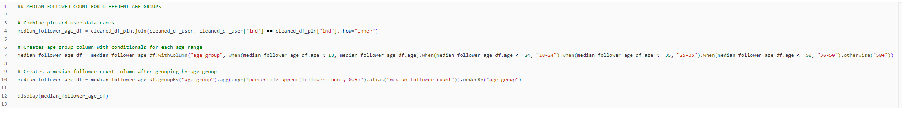

- This query was to find the median follower count for different age groups.

- The `pin` and `user` dataframes were combined using an `inner` join based on the common column `ind`.

- The `age_group` column was created again.

- The median of the `follower_count` column was found by grouping the dataframe by `age_group` and using `.agg(expr())` together with the expression `"percentile_approx()"` to create a column naming it `median_follower_count`. 

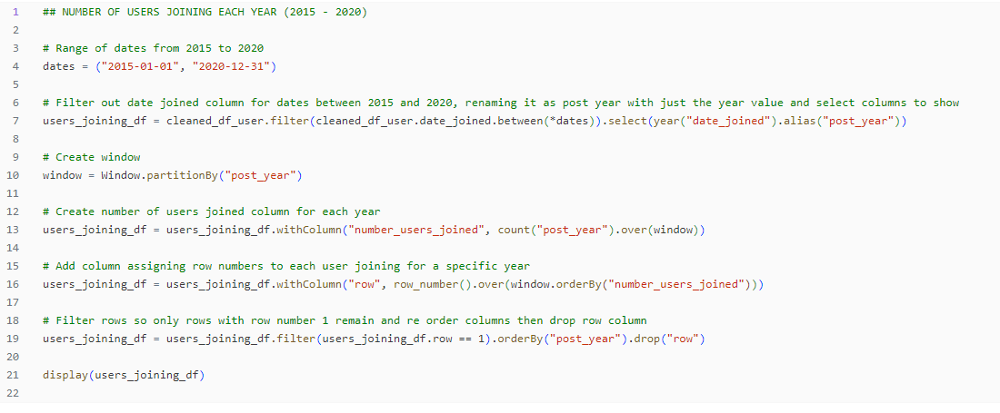

- This query was to find the number of users that joined each year.

- The `dates` variable was used to create a range of dates between 2015 and 2020 in order to find how many users joined each year during this time period.

- Only the year was taken from the `date_joined` column and created into a new column called `post_year`.

- A window was created and partitioned by `post_year`.

- The `number_users_joined` column was created using the window and `row_number()` functions.

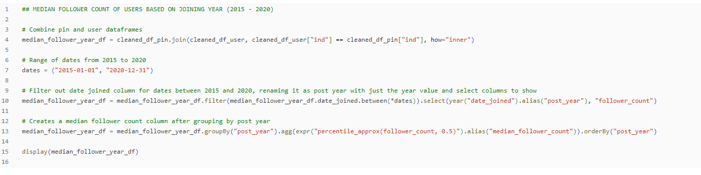

- This query was to find the median follower count of users based on their joining year.

- The `pin` and `user` dataframes were combined using an `inner` join based on the common column `ind`.

- The `dates` variable was created to create the `post_year` column. After grouping the dataframe by `post_year`, the median could be found using `.agg(expr())` again to return the median values within the column `median_follower_count`. 

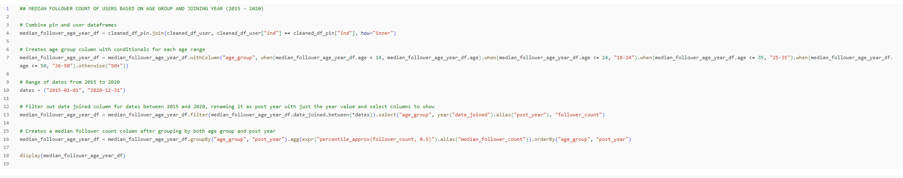

- This query was to find the median follower count of users based on both their joining year and age group.

- The `pin` and `user` dataframes were combined using an `inner` join based on the common column `ind`.

- The `age_group` column was created using `.withColumn()` together with `.when()` and `.otherwise()` similarly to before.

- This time, before finding the median, the dataframe was grouped by the `age_group` first and then the `post_year` to create the `median_follower_count` column.

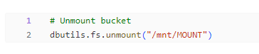

- To unmount the bucket `dbutils.ds.unmount()` was used. This command was neccessary at the end every time because later the whole workbook would be run automatically and the bucket wouldnt be able to mount without being unmounted at the end each time.

## Milestone 8 - Batch processing: AWS MWAA

This milestone was orchestrate Databricks workloads onf AWS MWAA.

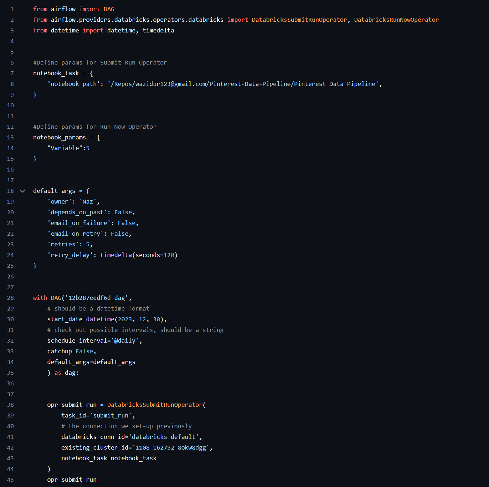

## Milestone 9 - Stream processing: AWS Kinesis