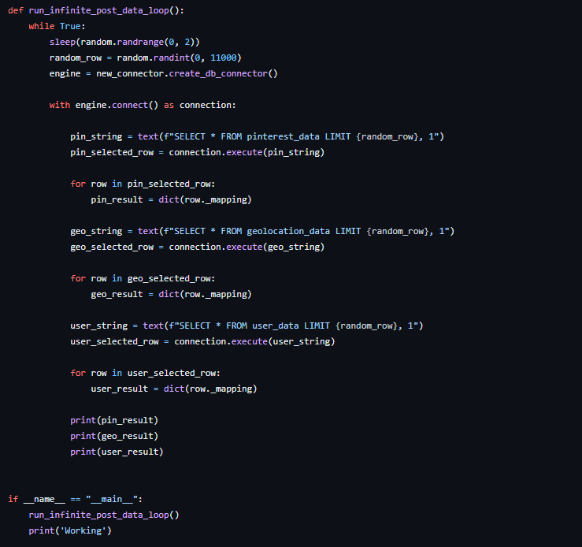

# Pinterest Project

Pinterest project.

## Milestone 1 - Environment setup

The first milestone involved setting up the Github repository as well as the dev environment. For this project, pymysql was installed through pip and several modules were imported including requests, boto3 and sqlalchemy. The AWS account that was to be used for this project was also set up at this stage using pre-existing credentials provided - various aspects of the project were provided along with an IAM user and SSH Keypair ID in order to locate all the correct resources and to be able to access them.

## Milestone 2 - Starting to build the pipeline

The second milestone was to import a python file into VSCode containing a script that communicated with an RDS database containing data to receive it in three tables: pinterest_data, geolocation_data and user_data. The data output here when running this was to emulate what a Pinterest API would receive when a POST request is made by users uploading data to Pinterest.

- A class was created here with a method `create_db_connector()` with various parameters such as `HOST`, `USER`, `PASSWORD`, `DATABASE`, and `PORT` all of which allowed a connection to the database containing all the data we need for this project.

- The function `run_infinite_post_data_loop` was used to create an infinite post data loop using a `while True:` loop to continuously receive and output data. Various SQL commands are also used to specifically receive a single random row of data from each table of data.

The three tables contained data about posts being updated to Pinterest (`pinterest_data`), data about the geolocation of each Pinterest post (`geolocation_data`) and data about the user that uploaded each post (`user_data`). `For` loops were used to iterate through each set of data in order to output them as a dictionary of key value pairs with the headings as the key and the data itself as the value using `dict(row._mapping)`.

## Milestone 3 - Batch processing: EC2 Kafka client configuration

12b287eedf6d-key-pair

ssh -i "12b287eedf6d-key-pair.pem" root@ec2-54-81-124-13.compute-1.amazonaws.com

git config --global user.email "you@example.com"
git config --global user.name "Your Name"

## Milestone 4 - Batch processing: Connecting MSK cluster to S3 bucket

## Milestone 5 - Batch processing: Configuring API in API gateway

## Milestone 6 - Batch processing: Databricks

## Milestone 7 - Batch processing: Spark on Databricks

## Milestone 8 - Batch processing: AWS MWAA

## Milestone 9 - Stream processing: AWS Kinesis